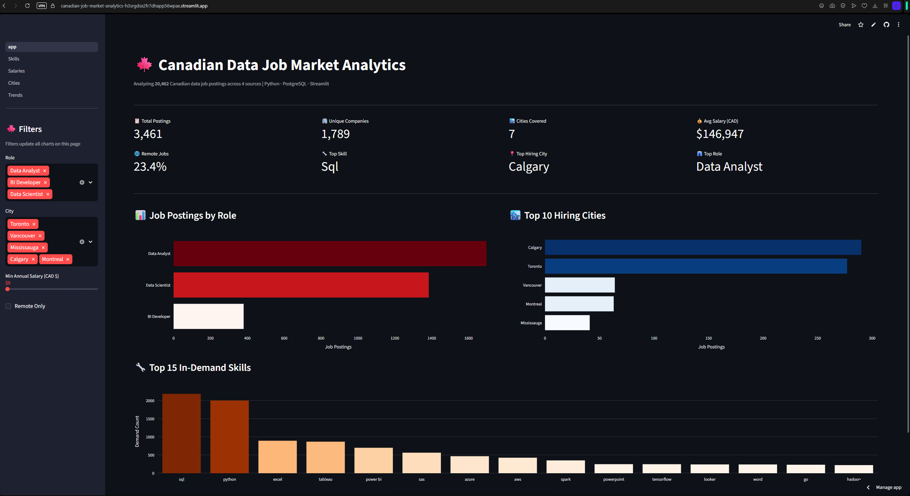
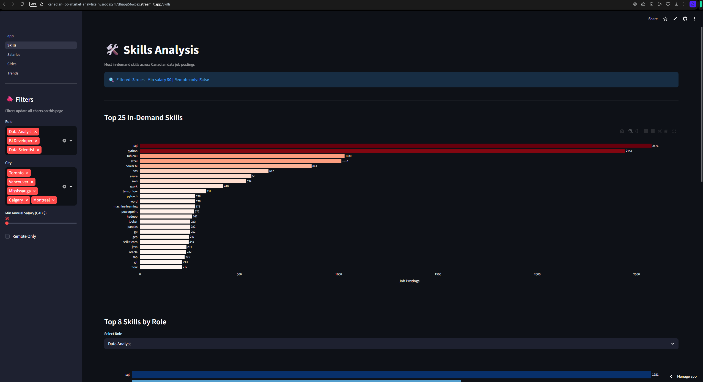
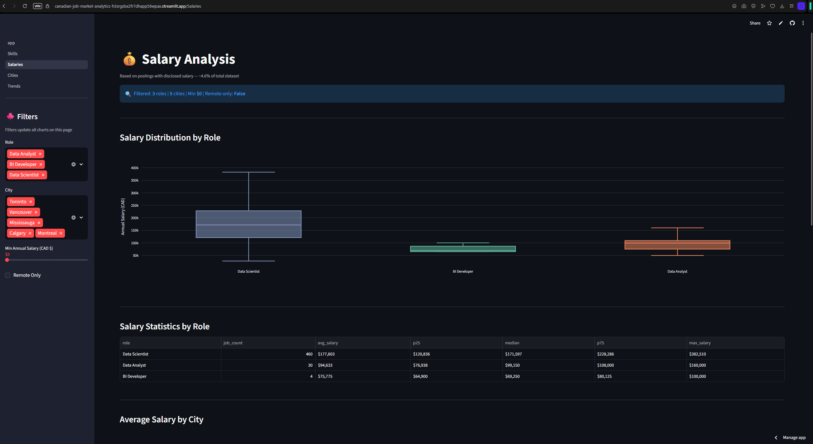
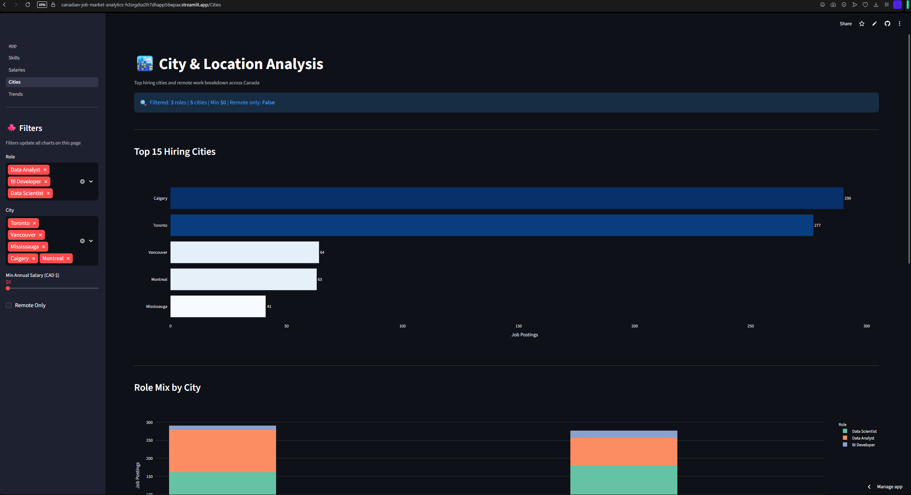
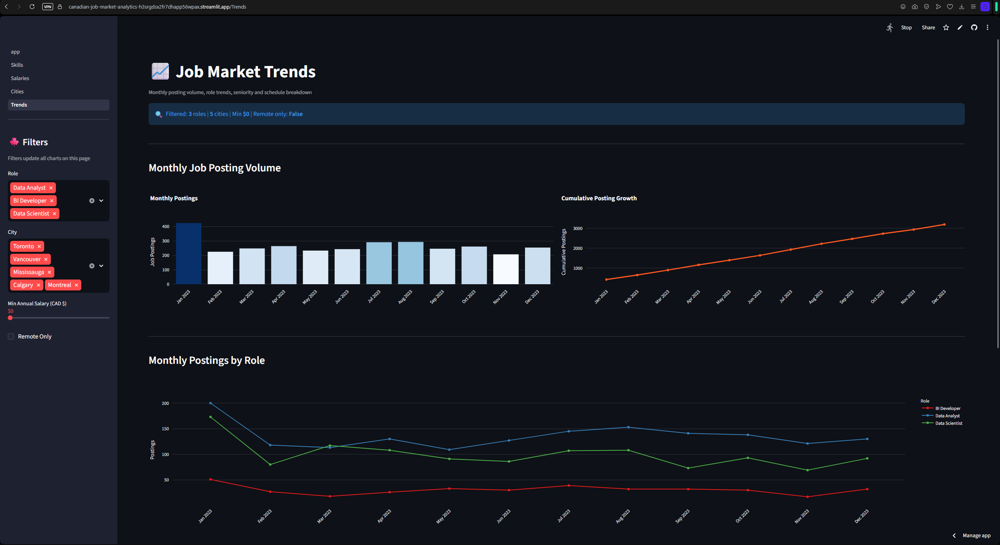

 
 
 🍁 Canadian Job Market Analytics

An end-to-end data analytics project analyzing **20,462 Canadian data job postings**
to uncover hiring trends, in-demand skills, salary distributions, and remote work patterns
across the Canadian data industry.

> **Live Demo →** [canadian-job-market-analytics.streamlit.app](https://canadian-job-market-analytics-h3srgdsx2fr7dhapp56wpax.streamlit.app)  
> **Tech Stack:** Python · PostgreSQL · Streamlit · Plotly · Pandas · Seaborn
---

## 📌 Project Overview

This project analyzes the Canadian data job market using a full end-to-end pipeline —
from multi-source data ingestion and PostgreSQL storage, through exploratory analysis,
to a deployed interactive dashboard. Built to demonstrate practical skills in
**SQL, Python, data modeling, and business intelligence reporting**
for Data Analyst and BI Developer roles across Canada.

**Key Questions Answered:**
- Which data roles and cities have the highest demand in Canada?
- What skills do Canadian employers require most?
- How do salaries vary by role, city, and seniority level?
- What are the remote work trends across data job categories?
- How has job posting volume changed over time?

---


## 🗂️ Project Structure

```text
Canadian Job Market Analytics/
├── dashboard/             # Streamlit app
│   ├── app.py             # Home page + KPIs
│   ├── db.py              # DB connection helper
│   └── pages/
│       ├── 1_Skills.py    # Skills analysis page
│       ├── 2_Salaries.py  # Salary analysis page
│       ├── 3_Cities.py    # City analysis page
│       └── 4_Trends.py    # Posting trends page
├── notebooks/
│   └── 01_eda.ipynb       # Full exploratory data analysis
├── outputs/               # EDA chart exports (PNG + HTML)
├── data/                  # Raw source datasets (gitignored)
├── db_connection.py       # Local PostgreSQL connection
├── requirements.txt       # Python dependencies
├── .gitignore
└── README.md
```

---

## 📊 Dataset

| Source | Rows | Description |
| --- | --- | --- |
| `lukebarousse` | 14,104 | LinkedIn data job postings |
| `techsalerator` | 5,454 | Canadian job board postings |
| `asaniczka` | 464 | Kaggle data jobs dataset |
| `elahehgolrokh` | 440 | Canadian data science postings |
| **Total (deduped)** | **20,462** | **Merged + cleaned** |

**Tables in PostgreSQL (`canadian_jobs_db`):**
- `jobs` — 20,462 rows, 17 columns
- `job_skills` — 116,180 rows (one skill tag per job per row)

---

## 🔍 EDA Highlights (`notebooks/01_eda.ipynb`)

- **Salary coverage:** Only 4.6% of postings include salary, typical for job board data
- **Top skills:** Python, SQL, AWS, Azure, Spark, Power BI
- **Top cities:** Toronto, Vancouver, Calgary, Montreal, Ottawa
- **Remote share:** 12.6% of postings are fully remote
- **Top role:** Data Engineer, followed by Data Analyst and Data Scientist
- **Seniority premium:** Senior roles command significantly higher median salaries than Mid or Junior

## 📈 Dashboard Pages

### 🏠 Home — KPI Summary


### 🛠️ Skills Analysis


### 💰 Salary Analysis


### 🏙️ City Analysis


### 📅 Posting Trends


---

## 🛠️ Tech Stack

| Layer | Technology |
| --- | --- |
| Language | Python 3.11 |
| Data Processing | Pandas, NumPy |
| Visualization | Plotly, Seaborn, Matplotlib |
| Database | PostgreSQL 17 (local) · Supabase (deployed) |
| Dashboard | Streamlit |
| EDA Notebook | Jupyter Notebook |
| Deployment | Streamlit Community Cloud |
| Version Control | Git + GitHub |

---

## 🚀 Run Locally

1. **Clone the repo**
	```bash
	git clone https://github.com/NirajanKhadka/canadian-job-market-analytics.git
	cd canadian-job-market-analytics
	```

2. **Create and activate the environment**
	```bash
	conda create -n job_analytics python=3.11
	conda activate job_analytics
	pip install -r requirements.txt
	```

3. **Set up PostgreSQL**
	- Create a local database: `canadian_jobs_db`
	- Run the ingestion scripts or restore from dump
	- Update credentials via environment variables if needed:
	```bash
	export LOCAL_DB_NAME=canadian_jobs_db
	export LOCAL_DB_USER=postgres
	export LOCAL_DB_PASSWORD=yourpassword
	```

4. **Run the dashboard**
	```bash
	streamlit run dashboard/app.py
	```

5. **Run the EDA notebook**
	```bash
	jupyter notebook notebooks/01_eda.ipynb
	```

---

## ☁️ Deployed Version

The live app connects to **Supabase** (hosted PostgreSQL) via the Session Pooler and is
deployed on **Streamlit Community Cloud**.

**Live URL:** [canadian-job-market-analytics.streamlit.app](https://canadian-job-market-analytics-h3srgdsx2fr7dhapp56wpax.streamlit.app)


## 📄 License

This project is open source and available under the [MIT License](LICENSE).